# **Log Analysis System**

This repository includes Backend Microservices (Login and Register) and Kafka Setup for a scalable log analysis system. It supports user authentication, user management, and real-time log processing via Kafka. The system uses Helm charts for easy Kubernetes deployment and Terraform for automating infrastructure management.

---
## **WorkFlow**

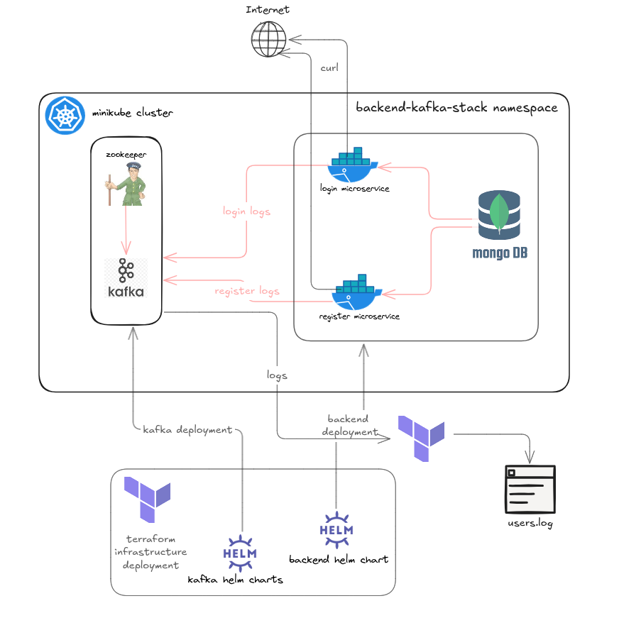

## **Features**

1. **Backend Microservices**:
   - **Login Microservice**: Handles user login and logout operations.
   - **Register Microservice**: Manages user creation, updates, and deletion.
   - **Integration with MongoDB** for data persistence.
   - **Integration with Kafka** for real-time logging and event streaming.
   - REST API endpoints for seamless integration.

2. **Kafka**:
   - Real-time message broker for log streaming.
   - A single topic, `users-logs`, for all user-related operations.


3. **Helm Development**:
   - **Backend Helm Chart**: Deploys the `login` and `register` microservices and MongoDB.
     - **Login Microservice**: Configures and deploys the login service.
     - **Register Microservice**: Configures and deploys the register service.
     - **MongoDB**: Configures and deploys a MongoDB database for data persistence.
   - **Kafka Helm Chart**: Deploys Kafka and Zookeeper services.
     - **Kafka**: Configures and deploys the Kafka message broker.
     - **Zookeeper**: Configures and deploys Zookeeper for Kafka coordination.
   - **Easy Deployment**: Helm charts simplify the deployment and management of the backend services and Kafka infrastructure.

4. **Terraform Implementation**:
   - **Automated Deployment**: Terraform is used to automate the deployment of Minikube clusters and the required infrastructure for backend microservices and Kafka.
   - **Minikube Cluster Setup**: Terraform configures and initializes a Minikube cluster for deploying the system.
   - **Helm Chart Deployment**: Terraform integrates with Helm to deploy the backend and Kafka services in Kubernetes.
   - **Infrastructure as Code**: Terraform scripts make it easy to replicate the environment and ensure consistency across deployments.


---

## **Project Structure**

```
log-analysis/
├── backend
│   ├── command.txt
│   ├── login-microservice
│   │   ├── dockerfile
│   │   ├── go.mod
│   │   ├── go.sum
│   │   ├── main
│   │   └── main.go
│   └── register-microservice
│       ├── dockerfile
│       ├── go.mod
│       ├── go.sum
│       └── main.go
├── database
│   └── mongo.txt
├── helm
│   ├── backend
│   │   ├── Chart.yaml
│   │   ├── templates
│   │   │   ├── login-microservice-deployment.yaml
│   │   │   ├── login-microservice-service.yaml
│   │   │   ├── mongodb-deployment.yaml
│   │   │   ├── mongodb-service.yaml
│   │   │   ├── register-microservice-deployment.yaml
│   │   │   └── register-microservice-service.yaml
│   │   └── values.yaml
│   ├── kafka
│       ├── Chart.yaml
│       ├── templates
│       │   ├── kafka-deployment.yaml
│       │   ├── kafka-service.yaml
│       │   ├── zookeeper-deployment.yaml
│       │   └── zookeeper-service.yaml
│       └── values.yaml
├── kafka
│   ├── docker-compose.yml
│   └── kafka-command.txt
├── log
│   └── users.log
├── README.md
└── terraform
    ├── main.tf
    ├── providers.tf
    ├── terraform.tfstate
    └── terraform.tfstate.backup

12 directories, 34 files
```

---


## **Backend Microservices [DEVELOPMENT]**

### **Database**

- **MongoDB** is used as the database for both microservices to persist user data.

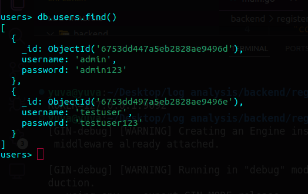

#### **Start MongoDB Container**
Run the following command to start the MongoDB container:

```bash
docker run -p 27017:27017 \
  -d \
  -e MONGO_INITDB_ROOT_USERNAME=root \
  -e MONGO_INITDB_ROOT_PASSWORD=root \
  --name mongodb \
  mongodb/mongodb-community-server:latest
```

#### **Access MongoDB Shell**
Log in to the MongoDB container:

```bash
docker exec -it mongodb mongosh -u root -p root
```

#### **Initialize Database**
1. Use the database `users`:

    ```javascript
    use users
    ```

2. Create the `users` collection:

    ```javascript
    db.createCollection("users")
    ```

3. Insert sample documents into the `users` collection:

    ```javascript
    db.users.insertMany([
      { username: "admin", password: "admin123" },
      { username: "testuser", password: "testuser123" }
    ])
    ```

#### **List Documents**
Verify the inserted documents:

```javascript
db.users.find()
```

---

### **Register Microservice**

Purpose: Handles user management (creation, update, and deletion).

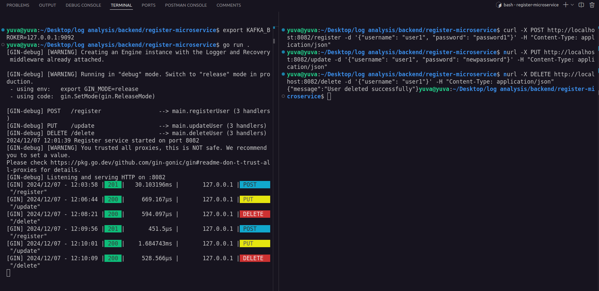

API Endpoints:

`POST /register` : Create a new user in the database.
`PUT /update` : Update an existing user's details.
`DELETE /delete` : Delete a user from the database.

| **Method** | **Endpoint**     | **Description**           | **Payload**                     |
|------------|------------------|---------------------------|---------------------------------|
| `POST`     | `/register`        | Create a new user         | `{ "username": "user1", "password": "password1" }` |
| `PUT`      | `/update`        | Update user details       | `{ "username": "user1", "password": "newpassword1" }` |
| `DELETE`   | `/delete`        | Delete a user             | `{ "username": "user1" }`           |

---

### **Login Microservice**

Purpose: Manages user login and logout.

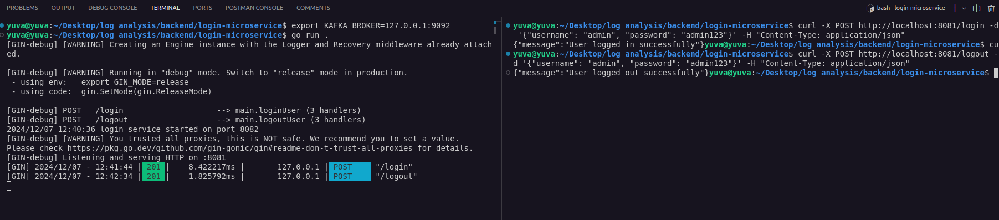

API Endpoints:

`POST /login` : Authenticate the user and generate a session or token.
`POST /logout` : Invalidate the user session or token.


| **Method** | **Endpoint** | **Description**       | **Payload**            |
|------------|--------------|-----------------------|------------------------|
| `POST`     | `/login`     | Log in a user         | `{ "username": "user1", "password": "password1" }` |
| `POST`     | `/logout`    | Log out a user        | `{ "username": "user1", "password": "password1" }`   |

---

## **Kafka**

### **Purpose**
Kafka is used to handle and store logs in the `user-logs` topic for analysis and monitoring purposes.

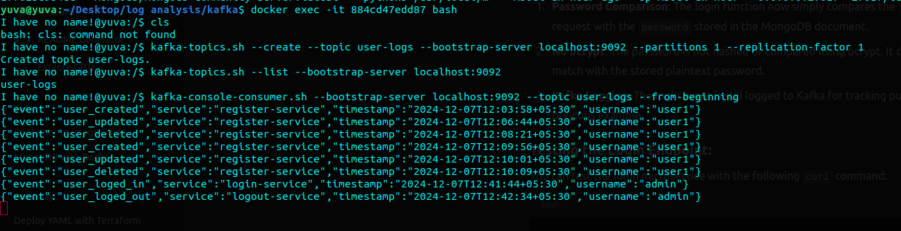

### **Setup for Development**

For development purposes, Kafka and Zookeeper are set up using **Docker Compose**.

| **Topic**       | **Description**                |
|------------------|--------------------------------|
| `users-logs`     | Logs all user-related activity (login, logout, user management operations) |

---

## **Helm Charts for Development**

This directory contains the Helm charts for deploying the **backend** microservices and **Kafka** for log analysis in a development environment.

---

#### **Backend Helm Chart**
The **backend** Helm chart is used to deploy the backend microservices (`login-microservice` and `register-microservice`) along with MongoDB.

- **Components:**
  - **Login Microservice:** Handles user login and logout operations.
  - **Register Microservice:** Handles user creation, update, and deletion.
  - **MongoDB:** Serves as the database for both microservices.

- **Usage:**
  - Update the `values.yaml` file with appropriate settings for your development environment.
  - Deploy the chart using:
    ```bash
    helm install backend ./backend
    ```

---

#### **Kafka Helm Chart**
The **Kafka** Helm chart is used to deploy Kafka and Zookeeper for log analysis in a development setup.

- **Components:**
  - **Kafka:** Used to handle user logs as a messaging system.
  - **Zookeeper:** Manages the Kafka cluster.

- **Usage:**
  - Configure the `values.yaml` file as needed.
  - Deploy the chart using:
    ```bash
    helm install kafka ./kafka
    ```

---

### **Terraform**

#### **Features**
- Deploys **backend microservices** (`login-microservice` and `register-microservice`) along with MongoDB.
- Deploys **Kafka** and Zookeeper for log management.
- Simplifies infrastructure provisioning in Minikube.

#### **Steps to Deploy**
1. **Initialize Terraform:**
   ```bash
   terraform init
   ```

2. **Generate a Dependency Graph:**
   Visualize the resource dependencies:

   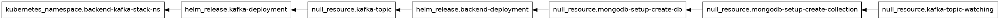

   ```bash
   terraform graph | dot -Tsvg > graph.png
   ```

3. **Plan and Apply Configuration:**
   Deploy the Helm charts with the following command:

   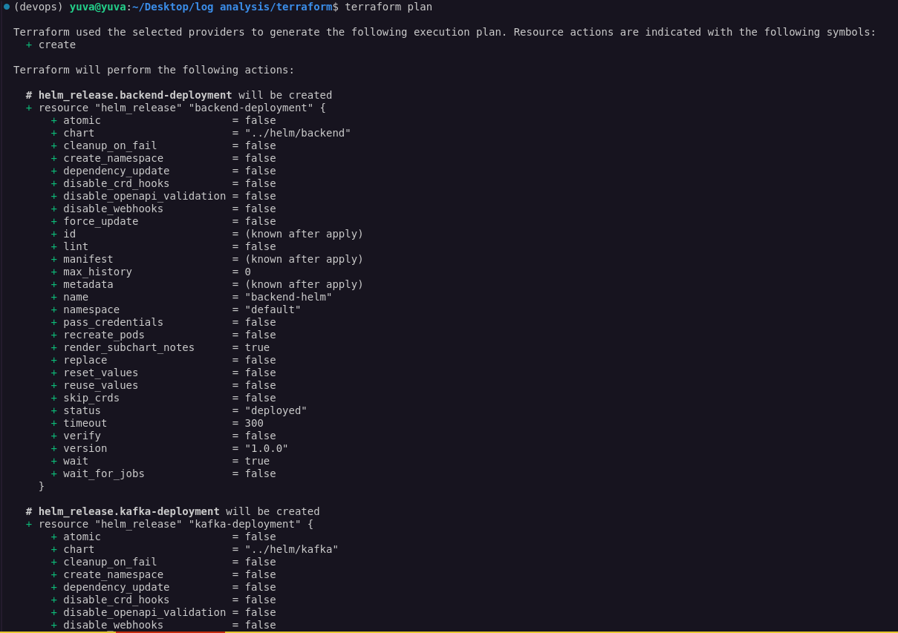

   

   ```bash
   terraform plan
   terraform apply
   ```

4. **Verify Deployment:**
   Check the status of the deployed resources:
   ```bash
   kubectl get all
   ```

---

### **Terraform Deployment Verification**

After deploying the Helm charts using Terraform, verify the successful deployment of all services in the Minikube cluster. Below are the expected pod outputs for the deployed resources:

#### **1. MongoDB Pod**
A pod running MongoDB should be visible:

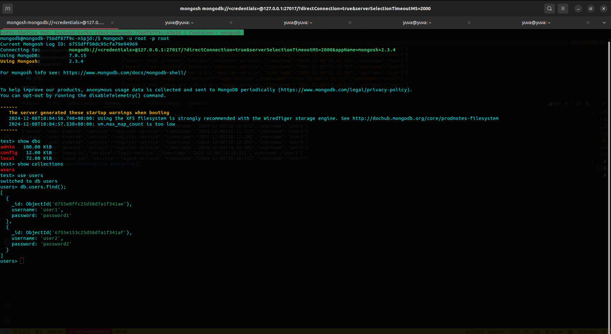

```plaintext
NAME                          READY   STATUS    RESTARTS   AGE
mongodb-7d4f5c6d94-xxxxx      1/1     Running   0          1m
```

#### **2. Login Microservice Pod**
The pod for the login microservice should be running:

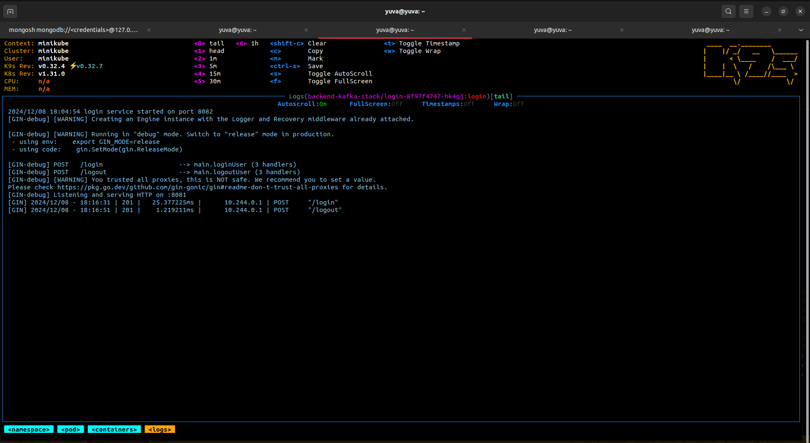

```plaintext
NAME                                 READY   STATUS    RESTARTS   AGE
login-microservice-xxxxxxx-xxxxx     1/1     Running   0          1m
```

#### **3. Register Microservice Pod**
Similarly, the register microservice pod should appear:

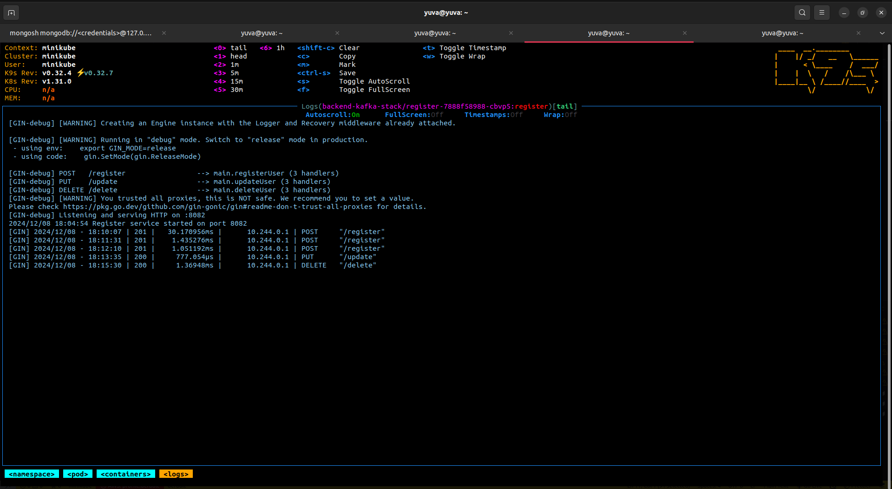

```plaintext
NAME                                     READY   STATUS    RESTARTS   AGE
register-microservice-xxxxxxx-xxxxx      1/1     Running   0          1m
```

#### **4. Zookeeper Pod**
The Zookeeper pod should be active to coordinate Kafka operations:

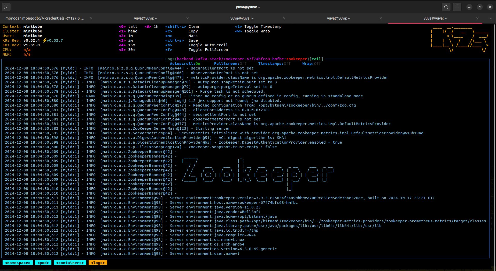

```plaintext
NAME                     READY   STATUS    RESTARTS   AGE
zookeeper-xxxxxxx-xxxxx  1/1     Running   0          1m
```

#### **5. Kafka Pod**
Finally, the Kafka pod should also be running:

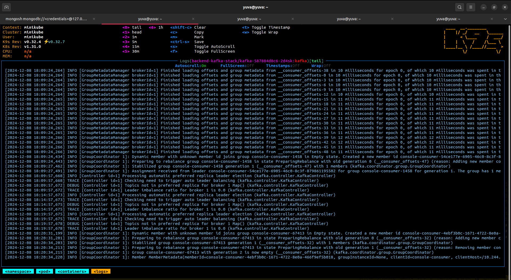

```plaintext
NAME                READY   STATUS    RESTARTS   AGE
kafka-xxxxxxx-xxxxx 1/1     Running   0          1m
```
---

## **Testing Backend Microservices Using cURL**

After deploying the backend microservices to Minikube, you can test their functionality using the following cURL commands. Ensure the Minikube services are running and accessible via the provided NodePorts.

---

### **Register Microservice**

**1. Create User**  
Endpoint: `/register` 

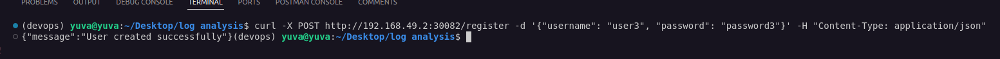

```bash
curl -X POST http://192.168.49.2:30082/register \
-d '{"username": "user1", "password": "password1"}' \
-H "Content-Type: application/json"
```

**2. Update User**  
Endpoint: `/update`

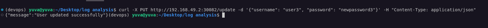

```bash
curl -X PUT http://192.168.49.2:30082/update \
-d '{"username": "user1", "password": "newpassword1"}' \
-H "Content-Type: application/json"
```

**3. Delete User**  
Endpoint: `/delete`  

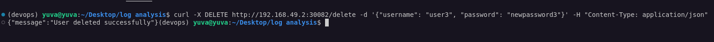

```bash
curl -X DELETE http://192.168.49.2:30082/delete \
-d '{"username": "user1"}' \
-H "Content-Type: application/json"
```

---

### **Login Microservice**

**1. Login User**  
Endpoint: `/login`  

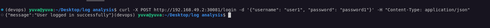

```bash
curl -X POST http://192.168.49.2:30081/login \
-d '{"username": "user1", "password": "password1"}' \
-H "Content-Type: application/json"
```

**2. Logout User**  
Endpoint: `/logout`  

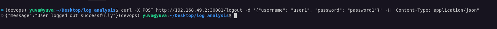

```bash
curl -X POST http://192.168.49.2:30081/logout \
-d '{"username": "user1", "password": "password1"}' \
-H "Content-Type: application/json"
```
---

### **Displaying Logs from Kafka's `user-logs` Topic**

To retrieve logs from the `user-logs` topic in Kafka, we can use the Kafka console consumer to consume messages directly from the topic.

#### **1. Open Kafka Consumer in Minikube**

To view logs in the `user-logs` Kafka topic, executed in the terraform:

```bash
resource "null_resource" "kafka-topic-watching" {
  depends_on = [null_resource.mongodb-setup-create-collection]

  provisioner "local-exec" {
    command = <<EOT
    kubectl exec -n backend-kafka-stack $(kubectl get pods -n backend-kafka-stack -l app=kafka -o jsonpath='{.items[0].metadata.name}') -- kafka-console-consumer.sh --bootstrap-server kafka:9092 --topic user-logs --from-beginning >> ../log/users.log
    EOT
  }
}
```

#### **2. Output**

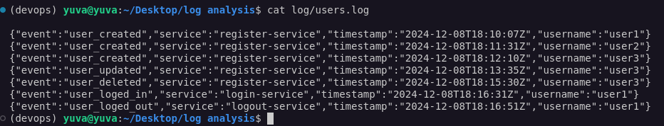


---